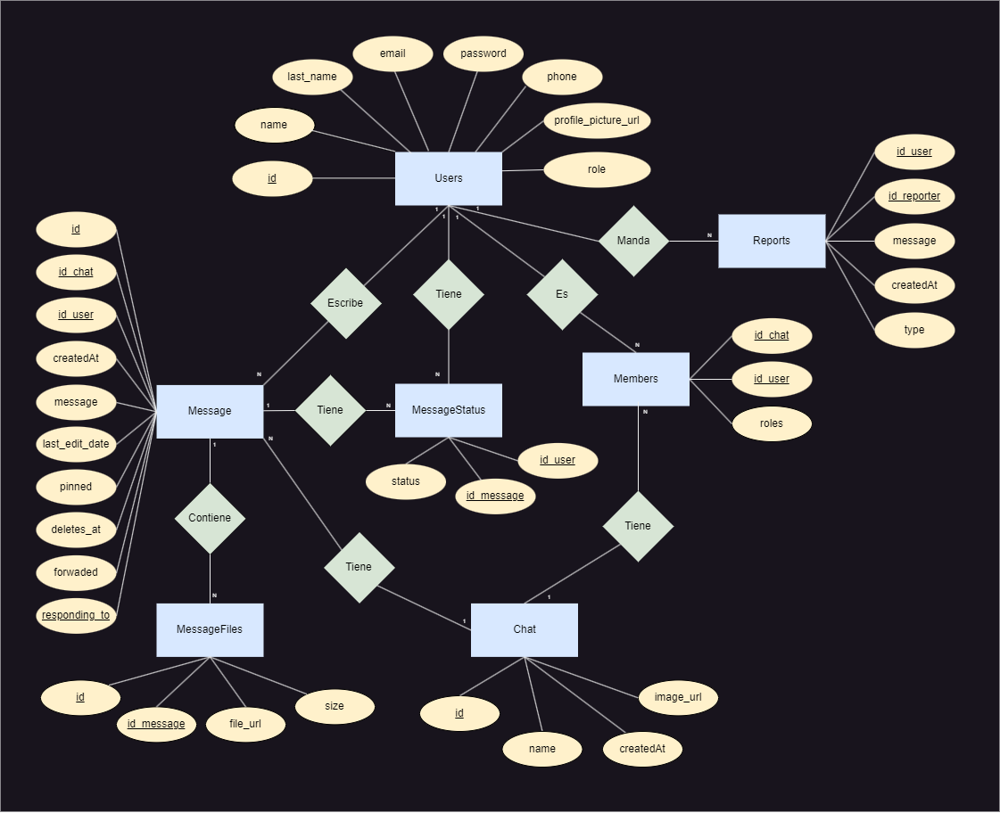
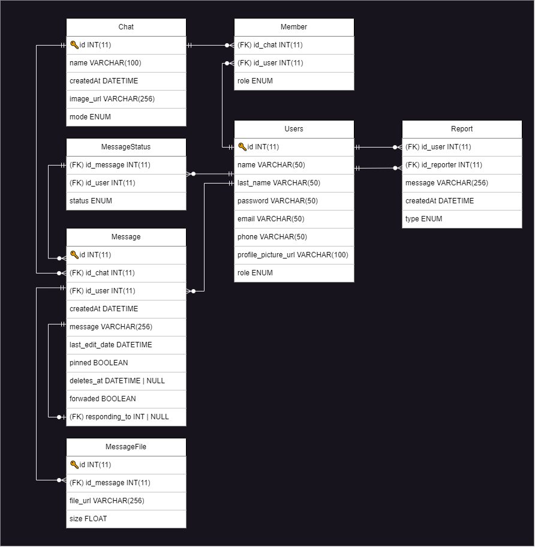

# React Madrid Backend

* :link: **Backend:** https://react-madrid-backend.onrender.com/
* :link: **Docs:** https://react-madrid-backend.onrender.com/docs

## Setup

1. Crear archivo `.env` copiando el archivo `.env.example`
2. Rellenar el archivo `.env` con las credenciales correspondientes
3. Instalar dependencias:

```bash
yarn install
```

4. Ejecutar postgresql:

```bash
sudo service postgresql start
```

5. Crear la base de datos y poblarla:

```bash
yarn db:reset
```

6. Correr el backend:

```bash
yarn dev
```

## Testing

1. Correr los tests y ver la cobertura:

```bash
yarn test
```

## Docs

Para ver los docs en local simplemente ingresa al endpoint `/docs` desde la pagina principal.

## Dependencias

- `koa`: Marco para la creación de la API
- `@koa/cors`: Permite habilitar CORS
- `koa-body`: Middleware para analizar el cuerpo de las solicitudes HTTP
- `koa-logger`: Middleware para registrar las solicitudes y respuestas HTTP
- `koa-router`: Router para Koa
- `dotenv`: Carga variables de entorno desde un archivo `.env` a `process.env`.
- `multer`: Middleware para la carga de archivos
- `@koa/multer`: Middleware para la carga de archivos con Koa
- `cloudinary`: Cliente para el servicio de almacenamiento de imágenes o archivos
- `pg`: Cliente para la base de datos PostgreSQL
- `pg-hstore`: Serializador/deserializador para el tipo de datos hstore de PostgreSQL
- `sequelize`: ORM (Object-Relational Mapping) para Node.js
- `koa2-swagger-ui`: UI para documentación de la API
- `anchorme`: Para la detección de URLs en texto
- `bcrypt`: Para hashing de contraseñas
- `jsonwebtoken`: Para la generación de JWTs (JSON Web Tokens)
- `koa-bodyparser`: Middleware para el análisis del cuerpo de las solicitudes HTTP
- `koa-jwt`: Middleware para la autenticación JWT en Koa
- `koa-websocket`: Para el soporte de WebSockets con Koa
- `react-use-websocket`: Hooks personalizados para WebSockets en React
- `yamljs`: Para la conversión de YAML a JSON y viceversa

## Dependencias de develop

- `eslint`: Herramienta de linting y formateo de código
- `nodemon`: Reinicia automáticamente la API cuando se realizan cambios en el código
- `sequelize-cli`: Permite utilizar comandos para Sequelize.
- `jest`: Para testing
- `faker`: Genera datos falsos para testing
- `supertest:` Para testear requests

## Diagrama Entidad-Relación :scroll:


## Esquema Relacional :scroll:
