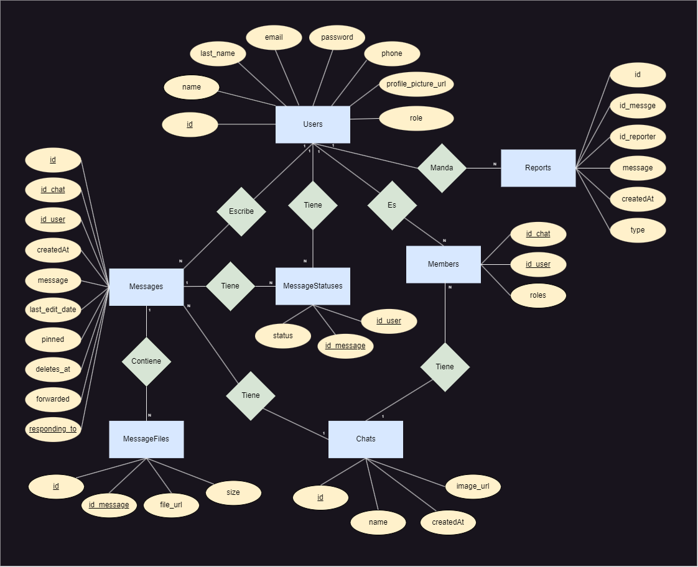

# React Madrid Backend

* :link: **Backend:** https://react-madrid-backend.onrender.com/

## Setup

1. Crear archivo `.env` copiando el archivo `.env.example`
2. Rellenar el archivo `.env` con las credenciales correspondientes
3. Instalar dependencias:

```bash
yarn install
```

4. Ejecutar postgresql:

```bash
sudo service postgresql start
```

5. Crear la base de datos y poblarla:

```bash
yarn db:reset
```

6. Correr el backend:

```bash
yarn dev
```

## Diagrama Entidad-Relación :scroll:


## Esquema Relacional :scroll:
